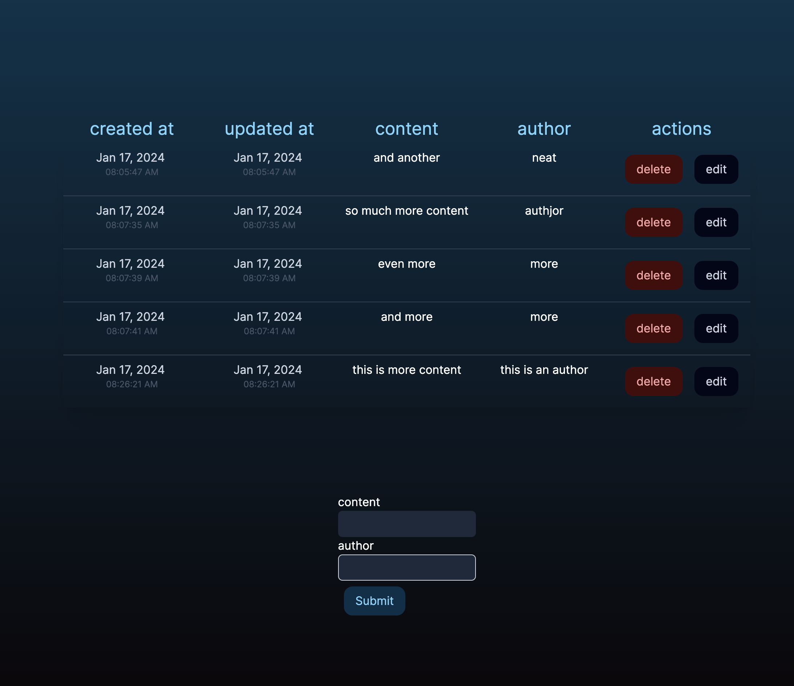
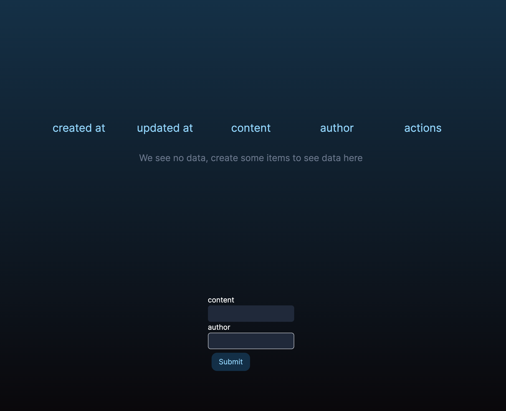
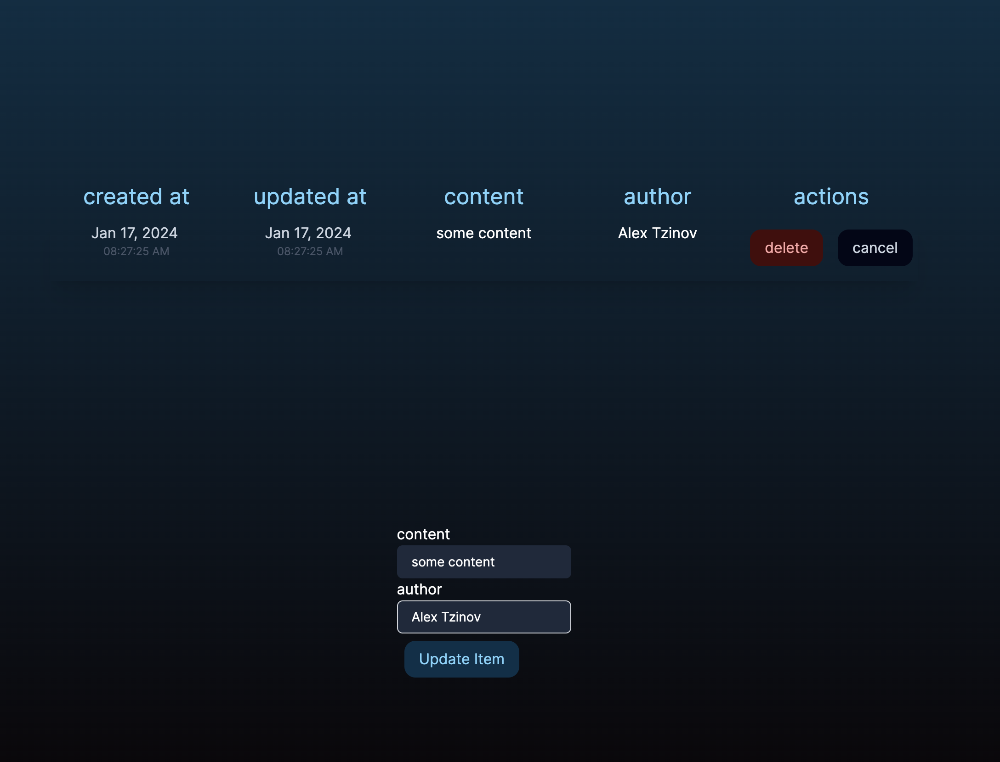
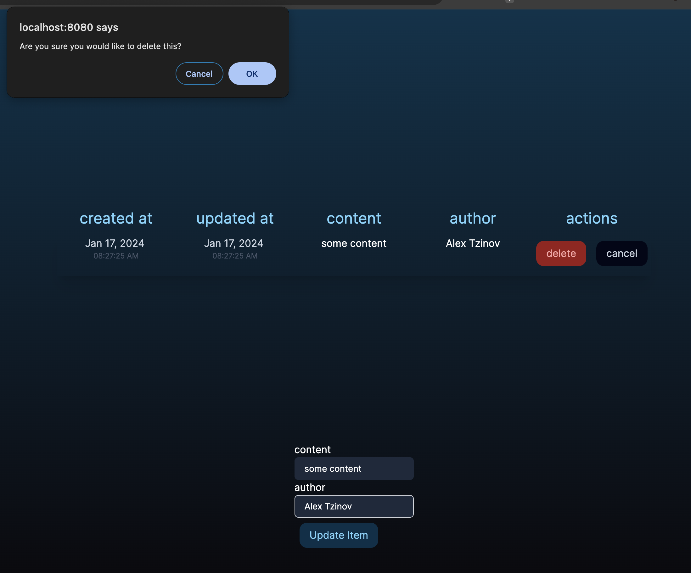

# Interview Coding Challenge

## Alex Tzinov Submission Notes

### Project Breakdown / Timeline of Work

- **Hour 0 - Hour 1**  
   Install Docker, get project running, fix CORS issue, dive into NextJS / NestJS / Formik and get acquainted with new technology stack. This was my first time using NestJS (come from ExpressJS) and only my second time using NextJS (come from strong client-only SPA background) and so I took the time to get acquainted and dive into documentation.

  Did not take me super long to get to the bottom of the CORS issue - for some reason I've had numerous dives into addressing CORS over the years and Splurv has a rather complicated domain & CORS setup so that was a fun mystery to uncover. My guess is that the `so make sure to use mode: 'no-cors' on all api calls to the BE` was meant to throw me off but if that was indeed required, then I've probably mis-understood a deep part of this assignment.

- **Hour 1 - Hour 1:30**  
   At this point with the project running, CORS fixed, and an understanding of the stack, I began to plumb through the remainder of the CRUD actions through the whole stack. I made some adjustments to the data-model with renaming some fields, extended the service layer with new functions, extended the controller layer with the new routes, and created a primitive and barebones UI to ensure data could move back and forth. At this point I had an app that could load data and display it, create new items, delete items, and edit an existing item.
- **Hour 1:30 - Hour 2:00**  
   I slowed down here to create the actual repository fork, start these notes, comment some of my work up until this point, and dive into Tailwind. I come from a Styled Components land and extensive experience and comfort in writing native CSS and so adopting Tailwind and trying to stay within the ergonomics of a utility-first framework took some adjustments

- **Hour 2:00 - Hour 3:30**  
   The majority of this time was spent playing around with Tailwind and handling a few UX things on the frontend (have edit mode populate the form, have delete confirm, scroll the table with a lot of results, style some buttons, etc). I also spent this time wrapping up this README, adding more comments, and unfortunately discovering NextUI and the components available there. Next time around I will definitely pay more attention to the installed libs and use off the shelf UI components vs. rolling my own.

  Total Time Start to Finish: 3.5 hours

### Screenshots

  
  
  
  

### Things I would do with more time

- Loading States on the UI. One of the things that I cut out for the sake of time and more complete documentation is visual loading states. I would be very much insisting that every single user interaction that will take time (page load for initial data, saving new item, deleting item, etc) will show a visual indiciator.
- Bring in a library called [`io-ts`](https://github.com/gcanti/io-ts) and create a more dedicated API service file in the UI to help with run-time contract type validation at the API boundary. This library helps you ensure that data is fitting the correct shape at the very boundary (where the fetch request is getting made) and either validate the shape and give the rest of the downstream UI a true guarantee of a schema, or, throw at that boundary and force the UI to handle the case of unexpected data from the API in a single spot.
- Bring in FontAwesome for iconography (edit / delete icons, table headers, etc). Have used Font Awesome in several projects and its quite amazing.
- Start carving out a more dedicated components library / design system to help with UI reusability, themeing, etc
- Bring in React Spring to help with fluid and smooth transitions in the UI (table sort, submit animations, etc)
- Understand the use-case for the product and if a mobile solution makes sense, create one
- Automated Tests. I would approach this by creating lower level UI components tests using Cypress Component testing (this would also push the codebase towards a design system / reusable UI components library), unit tests for any smaller pure utility functions, and then high-level smoke tests, again written in Cypress, to help with end to end tests

Welcome to the Fluint.io hands-on coding assignment. The goal of this assignment is NOT to create a production-level service but to allow us to see how you naturally go about implementing solutions to problems.

## Prerequisites

The following tools need to be installed on your development machine:

- Docker Desktop
- docker-compose

## Submission Steps:

1. Fork or degit (link https://github.com/Rich-Harris/degit) this repository.
2. Evaluate the README.md and solve the issues laid out in the scenario.
3. Send any questions for clarification to jon@fluint.io.
4. Submit your application by emailing a link to your solution and resume to jon@fluint.io.

## The Scenario

Build a simple form that allows users to create, edit, and delete data.

This will involve:

### Frontend (fe/):

Create UI with forms to add/edit data.
Display list of data.
Ability to delete data.

### Backend (be/):

APIs to create, read, update, and delete data.
Store data in a MongoDB database.
Database (mongodb/):

Collect data with fields like id, and content.

## The Environment

This is a monorepo for an application with a Next.js frontend and a Nest.js backend. All of the core scaffolding is in place that is needed to have these projects running locally. Everything is encapsulated in a docker-compose environment (including CLI containers), so the only dependencies needed to run the application are Docker Desktop and docker-compose.

The Mongoose configuration is in place for communication between the BE Nest.js project and the FE project.

## Important Commands

### Install dependencies

For the FE project:

Copy code

docker-compose -f docker-compose.cli.yml run --rm fe-cli npm install
For the BE project:

Copy code

docker-compose -f docker-compose.cli.yml run --rm be-cli npm install
Start the application
Copy code

docker-compose up
Note: This will start up the application and make the frontend of the application available from a browser at http://localhost:8080/, and the backend API is available at http://localhost:3000/. Changes on the backend will be hot deployed to the container.

### Stop the application

Copy code

docker-compose down

### Install a new library

For the FE project:

Copy code

docker-compose -f docker-compose.cli.yml run --rm fe-cli npm i <package>
For the BE project:

Copy code

docker-compose -f docker-compose.cli.yml run --rm be-cli npm i <package>

### Bash for a project

For the FE project:

Copy code

docker-compose -f docker-compose.cli.yml run --rm fe-cli bash
For the BE project:

Copy code

docker-compose -f docker-compose.cli.yml run --rm be-cli bash

## NOTES

- IMPORTANT: CORS is not enabled so make sure to use mode: 'no-cors' on all api calls to the BE
- Commands from the compose file docker-compose.cli.yml run in a container but are mounted to your local file system.
